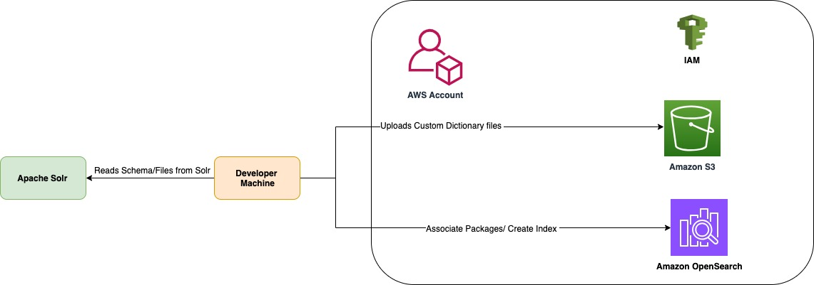

# Apache Solr to Amazon OpenSearch Schema and Data Migration

## Introduction 

The Guide helps migrate the Apache Solr schema to Amazon OpenSearch.
* Setup the Target Environment
* Migrate the Schema 
* Migrate Data 

## Architecture



As part of migration activity the tool does following steps:

**Initialisation**: It initialises the Apache Solr Client and Amazon OpenSearch Client by performing read operations 
to verify the credentials. 

**Migration**: Translates custom field types including its analyzers supporting the mapping of filters, tokenizers and char filters. 
Additionally it translates fields, copy fields and dynamic fields as per the migrated field types.
For each filter it reads it’s associated file from solr and creates OpenSearch packages by copying the file to 
Amazon S3 bucket and then associating the file with the OpenSearch domain based on user configuration. 

**Output**: It creates an index.json file to represent the updated mappings. 
It generates a reports summarising the migration process. 
Based on user configuration it creates the index in OpenSearch.


## Prerequisites
- AWS CLI installed and configured with appropriate credentials
- Required IAM permissions to deploy CloudFormation stacks
- Solr CLI
- Running Solr Instance 


## Setup the Target Environment

The cdk stack deploys the target environment which consist of the following 
* Amazon VPC 
* Amazon Opensearch domain 
* Amazon S3 Bucket 
* IAM Roles 
* Custom Resource that setups the roles mapping
* Amazon OSIS Pipeline 
  * S3 as source 
  * Opensearch as sink

#### Clone the repo
```
git clone git@ssh.gitlab.aws.dev:solr_to_opensearch/apache_solr_to_amazon_opensearch_schema_migration.git
cd apache_solr_to_amazon_opensearch_schema_migration
pip3 install -r requirements.txt
``` 

#### Deploy the cdk project 
* Navigate to cdk directory
```
cd apache_solr_to_amazon_opensearch_schema_migration/cdk
``` 
* Install the dependencies
```
npm install 
npm run build
```
* Deploy the project
```
cdk deploy 
```
* Note the Output


#### Update the existing AWS IAM Permission 
The tool needs permission to do the following: 
1: Copies files to Amazon S3 
2: Creates and Associate Packages in Amazon Opensearch 

Please update the below policy and attach to the AWS IAM identity that you use to run the tool.
Replace value OPENSEARCH_DOMAIN and AWS_S3_BUCKET using the output command received in previous step. 

```
{
    "Version": "2012-10-17",
    "Statement": [
        {
            "Sid": "VisualEditor0",
            "Effect": "Allow",
            "Action": [
                "es:ListDomainsForPackage",
                "es:CreatePackage",
                "es:UpdatePackage",
                "es:DescribePackages",
                "es:GetPackageVersionHistory"
            ],
            "Resource": "*"
        },
        {
            "Sid": "VisualEditor1",
            "Effect": "Allow",
            "Action": [
                "es:ListPackagesForDomain",
                "s3:PutObject",
                "s3:GetObject",
                "es:AssociatePackage",
                "es:DissociatePackage",
                "es:ESHttpPut"
            ],
            "Resource": [
                "arn:aws:es:<AWS_REGION>:<AWS_ACCOUNT>:domain/<OPENSEARCH_DOMAIN>",
                "arn:aws:es:<AWS_REGION>:<AWS_ACCOUNT>:domain/<OPENSEARCH_DOMAIN>/*",
                "arn:aws:s3:::<AWS_S3_BUCKET>/migration_schema/*",
                "arn:aws:s3:::<AWS_S3_BUCKET>/migration_data/*"             
            ]
        }
    ]
}
```
## Solr to OpenSearch Schema Migration

###  Setup the Tool 

* Navigate back to main directory and Install the dependencies
```
cd ..
pip3 install -r requirements.txt
``` 

### Configure the Tool 
* Update the migrate.toml file with the values:
```
[solr]
host= < Update with the Apache Solr address >  
port=<Update the Port >
username='<Solr Username>'
password='<Solr Password>'
collection=<Solr Collection>


[opensearch]
use_aws_auth_sigv4=<Boolean to indicate if to use the sigv4 authentication> 
domain=<Opensearch Domain>
bucket=<Amazon S3 Bucket to store the custom dictinoary files>
host=<Opensearch Host>
port=<Opensearch Port>
username=<Opensearch user> 
password=<Opensearch password>
use_ssl=<To use ssl or not>
assert_hostname=< Boolean to Assert hostname >
verify_certs=<Boolean to Verify certs >
index=< The index name to create >


[migration]

create_package=< Boolean to indicate if Amazon Opensearch packages to be created or not >
expand_files_array=< Boolen to indicate if dictionary should be expanded in the filter definitions. Cannot be true if create_package is true>
create_index=<Boolean to indicate if index needs to be created in Amazon Opensearch >

```
### Enable port forwarding to OpenSearch
As best practices, Amazon Opensearch is running in the VPC. 
To connect to the Opensearch from the machine we are using SSM port forwarding. 

* Port Forwarding command is available in the Stack output. 
* On a seperate Terminal run the command copied. 

```
Execute the command 
```

### Run migration 

To run the tool follow the below instructions 

```
cd apache_solr_to_amazon_opensearch_schema_migration
python3 main.py migrate
``` 

### Review the migration reports

Log file verification and viewing the summary:

- The migration tool produces an output with name index.json. 
- This file contains the mappings and settings configuration generated for Amazon OpenSearch.
- Additionally, a html file with name report.html is generated that shows the summary of the migration. 
- The report contains details on success and error mapping details for fields, fieldtypes etc.

Note: Fix the index schema for fields that are not migrated. 


## Solr to OpenSearch Data Migration


#### Export the Solr Data 

The tool automatically exports Solr data to S3 as part of the migration process. Configure the data migration settings in your `migrate.toml` file:

```toml
[data_migration]
migrate_data=true
s3_export_bucket="<your-migration-bucket-name>"
s3_export_prefix="migration_data/"
region="us-east-1"
batch_size=1000
rows_per_page=500
max_rows=100000
```

**Configuration Parameters:**
- `migrate_data`: Enable/disable data migration (true/false)
- `s3_export_bucket`: S3 bucket name for exported data (use bucket from CDK output)
- `s3_export_prefix`: S3 prefix for data files (default: "migration_data/")
- `region`: AWS region
- `batch_size`: Number of documents per batch
- `rows_per_page`: Solr query page size
- `max_rows`: Maximum documents to export

**Run Data Export:**
```bash
cd apache_solr_to_amazon_opensearch_schema_migration
python3 main.py
```

The tool will:
1. Query Solr collection for total document count
2. Export data in batches using cursor-based pagination
3. Handle binary fields (Base64 encoding fixes)
4. Upload JSON files to S3 bucket under `migration_data/` prefix
5. Generate data migration report

**Prerequisites:**
- AWS credentials configured for S3 access
- S3 bucket created (from CDK deployment)
- Solr collection accessible

**Output:**
- Data files uploaded to: `s3://<bucket-name>/migration_data/`
- Migration report: `data_migration_report.html`

#### Restart OSIS Pipeline

After data export, restart the OSIS pipeline to detect new files in S3:

```bash
# Default pipeline name is: solr2os-pipeline
aws osis stop-pipeline --pipeline-name solr2os-pipeline

# Wait for pipeline to stop (check status)
aws osis get-pipeline --pipeline-name solr2os-pipeline

# Start pipeline again
aws osis start-pipeline --pipeline-name solr2os-pipeline
```

**Note:** The pipeline uses S3 scan configuration which requires restart to detect new files. Monitor pipeline status in AWS Console.

**Note:** The pipeline can be restarted via console as well.

####  Upload Sample Data to S3

Sample File Format (test.json)**:

   ```json
     [
       {
          "id": "1",
          "name": [
            "Product 1"
          ],
          "address": "123 Main St, City A",
          "user_token": "user_1_token",
          "age": 25,
          "last_modified": "2023-06-01T10:00:00Z",
          "city": "City A",
          "coordinates_xy": "37.7749,122.4194",
          "product_title_sortable": "Product 1 - Premium",
          "file_attachment": "UGFja2FnZSBkZXRhaWxzIGZvciBwcm9kdWN0IDE=",
          "geo_location": "37.7749,122.4194",
          "temperature": 22.5,
          "coordinates_xy_0___pdouble": 37.7749,
          "coordinates_xy_1___pdouble": 122.4194,
          "comments": [
            {
              "id": "1/c1",
              "comment": "Great product!",
              "rating": 5
            }
          ]
       }
     ]
```
**Note:** Ensure the uploaded file has a top-level `[]` array.


#### Data Flow Summary

- Files uploaded to S3 
- Restart the OSIS pipeline.
- Data is pushed to OpenSearch into the index: **`${INDEX_NAME}`** (default: `solr_migration`).

- You can search and view the documents inside OpenSearch under the index `${INDEX_NAME}`. 
- Navigate to https://localhost:8200/_dashboards. 
- Note: Retreive the Secret ID from the cdk output and login.

#  Cleanup (Optional)
* Clean up the resources.
```
cdk destroy 
```


